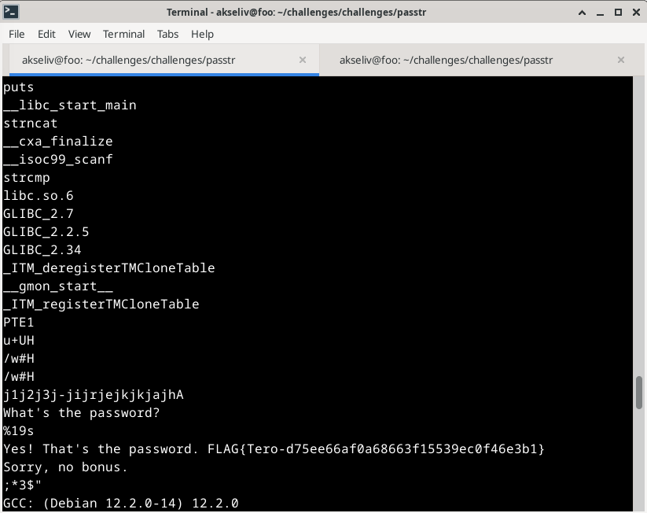

### No strings attached

Ympäristö<br>
Debian (64-bit)<br>
4096 MB muisti<br>
3 prosessoria<br>

## a) Strings
Otin ensiksi selvää, mikä tämä "strings"-ohjelma on. Tieto löytyi ioflood-sivulta [Using the 'strings' Command](https://ioflood.com/blog/install-strings-command-linux/#Using_the_8216strings8217_Command). Luettuani ohjeita läpi kokeilin komentoa `strings passtr`, joka palautti pitkän listan erilaisia tietoja. Tietojen seassa luki teksti "sala-hakkeri-321". Syötin salasanan passtr-ohjelmaan ja sain vastauksena "Yes! That's the password."

`FLAG{Tero-d75ee66af0a68663f15539ec0f46e3b1}`

## b) Korjattu passtr 
Löysin GitHub-repon, jossa käsitellään juuri tehtävänannon kaltaista "string"-tyypin piilottamista binäärissä. [c_hide_strings](https://github.com/mafonya/c_hide_strings). Käytin repon antamaa esimerkkikoodia, jota muokkasin ChatGPT:n avulla (https://chatgpt.com/), sillä en ole koskaan koodannut C-kielellä.
Korjatussa koodissa salasana "piilotetaan" rakentamalla se kirjain kerrallaan, jotta binääriin ei tule muuttujaa näytettäväksi.

#### Korjattu versio:

```c
// passtr - a simple static analysis warm up exercise
// Copyright 2024 Tero Karvinen https://TeroKarvinen.com

#include <stdio.h>
#include <stdarg.h>
#include <string.h>

void build_password(char *buf, ...) {
    va_list args;
    va_start(args, buf);

    char arg = va_arg(args, int);
    buf[0] = '\0';
    
    while (arg) {
        strncat(buf, &arg, 1);
        arg = va_arg(args, int);
    }

    va_end(args);
}

int main() {
	char password[20];
	char actual_password[20];

	build_password(actual_password, 's', 'a', 'l', 'a', '-', 'h', 'a', 'k', 'k', 'e', 'r', 'i', '-', '3', '2', '1', '\0');
	
	printf("What's the password?\n");
	scanf("%19s", password);
	
	if (strcmp(password, actual_password) == 0) {
		printf("Yes! That's the password. FLAG{Tero-d75ee66af0a68663f15539ec0f46e3b1}\n");
	} else {
		printf("Sorry, no bonus.\n");
	}
	return 0;
}
```
Kuten kuvassa näkyy salasana ei enään tule esille komennolla "strings passtr"



## c) Packd
Koitin ensimmäiseksi ajaa komennon "strings packd" nähdäkseni miltä se näyttää. Harmillisesti komentokonsoliin ei tullut suoraan salasanaa tai flagia, vaan osia niistä. Lueskellessani tulostettuja tietoja läpi huomasin, että sovellus on paketoitu käyttäen upx-työkalua. En ollut kuullut tästä ennen, mutta arvelin sen liittyvän jotenkin ohjelman salaukseen.

Löysin artikkelin, jossa käsitellään upx-paketoitujen ohjelmien paketoimista ja purkamista [täältä](https://0xh3xa.github.io/defensive/unpack-upx/). Tekstin seasta löytyi esimerkkikomento "upx -d hello-packed.exe --o hello-unpacked.exe", joka näytti mielenkiintoiselta. Latasin upx-työkalun virtuaalikoneelleni. Kokeilin komennosta hieman yksinkertaisempaa versiota: "upx -d packd".


Seuraavaksi ajoin komennon "strings packd" uudelleen, lista oli huomattavasti laajempi, ja tällä kertaa siellä oli mukana salasana ja flagi samalla tavalla, kuin passtr-ohjelmassa.


Salasana: piilos-AnAnAs <br>
Flag: FLAG{Tero-0e3bed0a89d8851da933c64fefad4ff2}

### Lähteet

ioflood. How to Install and Use ‘Strings’ Command in Linux. Luettavissa: [https://ioflood.com/blog/install-strings-command-linux/#Using_the_8216strings8217_Command](https://ioflood.com/blog/install-strings-command-linux/#Using_the_8216strings8217_Command). Luettu: 8.11.2024.

ChatGpt. [ChatGpt](https://chatgpt.com/). Käytetty: 8.11.2024.

Mafonya. c_hide_strings. Luettavissa: [https://github.com/mafonya/c_hide_strings](https://github.com/mafonya/c_hide_strings). Luettu: 8.11.2024.

0xh3xa. Unpacking UPX packer.
Luettavissa: [https://0xh3xa.github.io/defensive/unpack-upx/](https://0xh3xa.github.io/defensive/unpack-upx/). Luettu: 8.11.2024.

terokarvinen. New Course: Application Hacking. Luettavissa: [https://terokarvinen.com/application-hacking/#laksyt](https://terokarvinen.com/application-hacking/#laksyt). Luettu: 8.11.2024.
