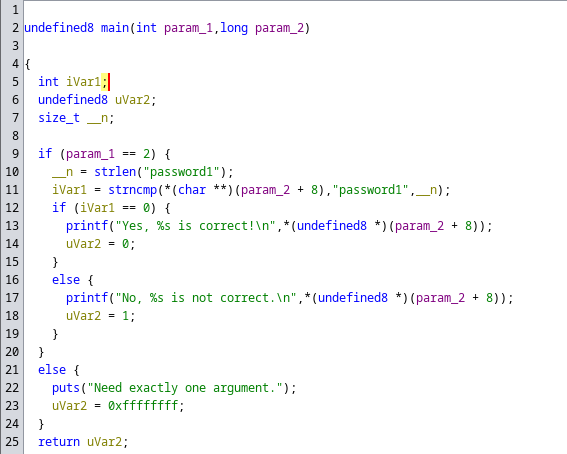
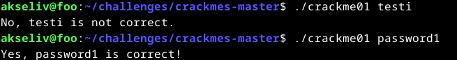
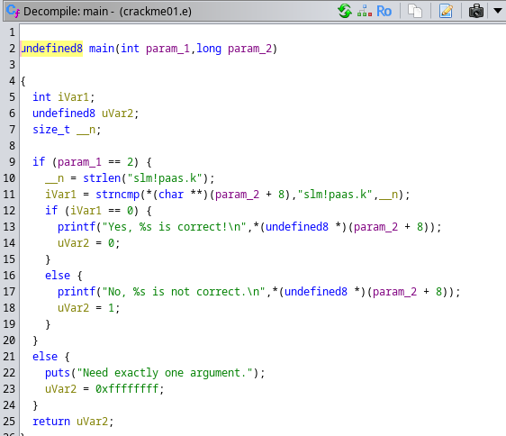
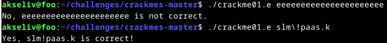
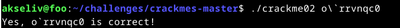

# Kääntöpaikka

## x)
Hammond 2022: Ghidra for Reverse Engineering (PicoCTF 2022 #42 'bbbloat') [https://www.youtube.com/watch?v=oTD_ki86c9I](https://www.youtube.com/watch?v=oTD_ki86c9I)
- strace, ltrace ja objdump yritykset ennen monimutkaisempia sovelluksia, kuten Ghidra
- En ole varma mitä tähän pitäisi kirjoittaa, muuta kuin, että videossa käydään läpi Ghidran käyttämistä ohjelmien hakkeroinnissa

## a)
Asensin Ghidran

## b) rever-C

Ohjelmaan alustetaan kaksi muuttujaa; difference (kuvaa annetun salasanan ja oikean salasanan välisiä eroja) ja given_password (käyttäjän syöttämä salasana). Ohjelma kysyy ensin salasanaa käyttäjältä, jonka jälkeen se vertaa annettua salasanaa oikeaan salasanaan strcmp-funktiolla. Eron ollessa 0, eli eroa ei ole, ohjelma tulostaa flagin. Eron ollessa > 0 ohjelma tulostaa tekstin "Sorry, no bonus"

## c) Jos väärinpäin
Vaihdoin ohjelmassa JNZ (Jump Not Zero)-kohdan, jossa tarkistetaan syötetty salasana ja verrataan sitä oikeaan salasanaan JZ: ksi (Jump Zero). Koittaessani ajaa muutettua ohjelmaa sain vain viestin "Permission denied", enkä osaa korjata ongelmaa, joten en voi demota, tai kokeilla ratkaisuani.
 
Sain ongelman korjattua antamalla ohjelmalle ajo-oikeudet komennolla "chmod +x ./passtr.1".

## e) Nora crackme01
Ongelmia ilmeni heti alussa, kun koitin saada ohjelmaa edes käynnistymään, sillä Linuxin käyttö on vielä hakusessa.  
Ajaessani ensin komennon "make crackme01" ja sitten "./crackme01" konsoliin tulostuu "Need exactly one argument". En nyt tiedä tarkoittaako tämä, että ohjelma ei edes käynnistynyt vai, että pitääkö sen tulostaa tämä konsoliin, mutta oletan kaiken toimivan niinkuin pitääkin. 
Avasin crackme01.c: n ghidrassa ja luin main-funktiota läpi.

Funktiossa näkyy teksti "password1", mikä vaikutti olevan tarvittu salasana ja niinhän se olikin.

## e) Nora crackme01e
Käytin komentoa gcc -o crackme01.e crackme01e.c luodakseni ajettavan version ohjelmasta sillä pelkkä "make crackme01e.c" ei tuntunut toimivan.  
Decompilerissä ghidrassa näkyi teksti "slm!paas.k", joka olisi voinut olla salasana, mutta sitä kokeillessani sain vastaukseksi vain "bash: !paas.k: event not found", joten se ei ilmeisesti ollutkaan suoraan se. Olin kyllä aika varma, että tämä teksti on avain tehtävän ratkaisuun, joten jatkoin sen tutkimista ghidrassa.

 
Vaikutti siltä, että "slm!" sekoittaa Linuxin komentorivin luulevan tekstin olevan komento. Koitin etsiä tätä ratkaisua netistä erilaisilla hakusanoilla, mutta päädyin lopuksi käyttämään ChatGpt: tä. Syöttämällä komennon näin: "slm\!paas.k", sitä ei enää tulkittu komentona vaan tekstinä.

## f) Nora crackme02
Alkuperäisessä muodossa ghidrassa ohjelma näyttää tältä.

Koodi on aika sotkuisen näköistää, mutta jos ymmärsin oikein koodissa verrataan merkkijonon "password1", jokaista merkkiä, että se ei ole "\0" tai "NULL". Jos merkki plus -1 ei ole jotain (en tiedä mitä ehtolausekkeessa tapahtuu) ohjelma palauttaa 1 eli ratkaisu ei ole oikein. 
Ohjelmassa hämmentää se, että pääfunktio ottaa parametreiksi kaksi parametriä. 
En osannut lukea koodia tarpeeksi hyvin tai ymmärtääkseni mitä siinä tapahtuu ymmärtääkseni mitä muuttujia pitää uudelleennimetä ja jouduin katsomaan lähdekoodia saadakseni ohjelman ratkaistua.

