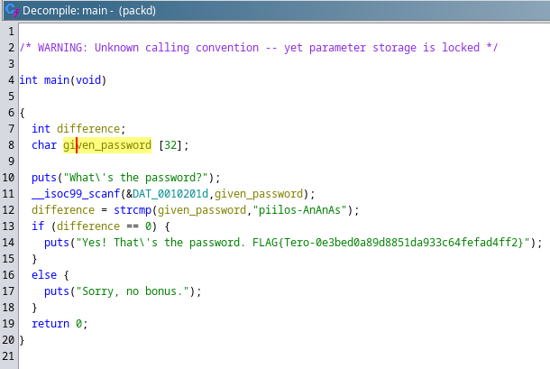

# Kääntöpaikka

## x)
Hammond 2022: Ghidra for Reverse Engineering (PicoCTF 2022 #42 'bbbloat') [https://www.youtube.com/watch?v=oTD_ki86c9I](https://www.youtube.com/watch?v=oTD_ki86c9I)
- strace, ltrace ja objdump yritykset ennen monimutkaisempia sovelluksia, kuten Ghidra
- En ole varma mitä tähän pitäisi kirjoittaa, muuta kuin, että videossa käydään läpi Ghidran käyttämistä ohjelmien hakkeroinnissa

## a)
Asensin Ghidran

## b) rever-C

Ohjelmaan alustetaan kaksi muuttujaa; difference (kuvaa annetun salasanan ja oikean salasanan välisiä eroja) ja given_password (käyttäjän syöttämä salasana). Ohjelma kysyy ensin salasanaa käyttäjältä, jonka jälkeen se vertaa annettua salasanaa oikeaan salasanaan strcmp-funktiolla. Eron ollessa 0, eli eroa ei ole, ohjelma tulostaa flagin. Eron ollessa > 0 ohjelma tulostaa tekstin "Sorry, no bonus"

## c) Jos väärinpäin
Vaihdoin ohjelmassa JNZ (Jump Not Zero)-kohdan, jossa tarkistetaan syötetty salasana ja verrataan sitä oikeaan salasanaan JZ: ksi (Jump Zero). Koittaessani ajaa muutettua ohjelmaa sain vain viestin "Permission denied", enkä osaa korjata ongelmaa, joten en voi demota, tai kokeilla ratkaisuani.
 
Sain ongelman korjattua antamalla ohjelmalle ajo-oikeudet komennolla "chmod +x ./passtr.1".

