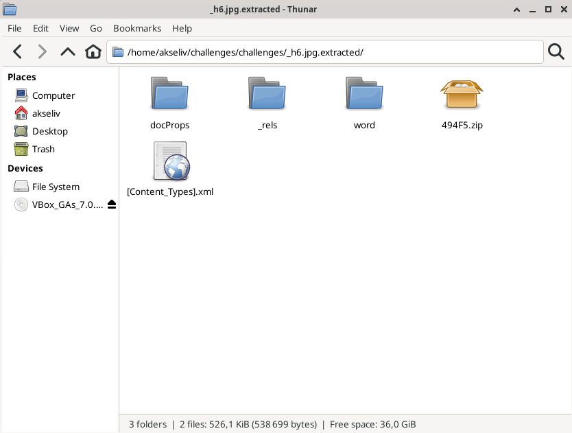
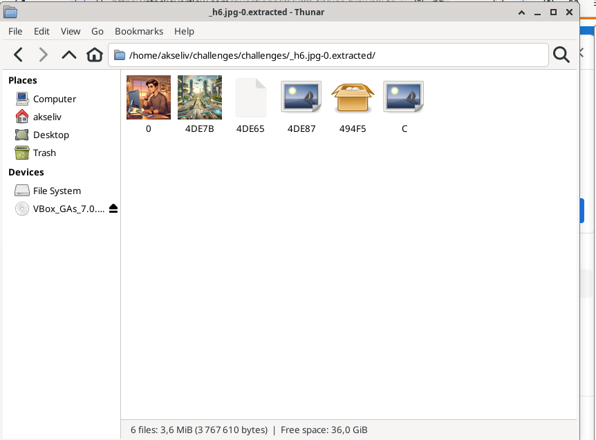
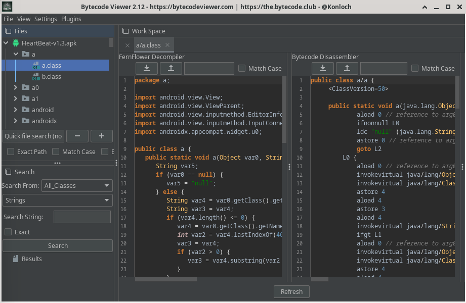

# h6 Sulaa hulluutta

  ## a)
  Koitin tutkia tiedostoa strings ja ghidra työkaluilla, mutta en saanut kummallakaan mitään tietoa irti tiedostosta
  ## b)
  Ensimmäiseksi latasin binwalk: n virtuaalikoneelleni
   
  `sudo apt install binwalk`
   
   
  Seuraavaksi ajoin komennon, jonka avulla pystyy decompressaamaan tiedostoja ja purkamaan niitä
   
  `binwalk -e h6.jpg`
   
   
  Näin sain purettua tiedostosta uuden kansion, jossa oli "salattuja" kansioita ja tiedostoja nimeltään **_h6.jpg.extracted**
   
   
  
   
   
  Löydettyjä kansioita ja tiedostoja olivat muunmuassa:
  ### docProps kansio
  - app.xml
  - core.xml

  ### word kansio
  - document.xml
  - fontTable.xml
  - numbering.xml
  - settings.xml
  - styles.xml
  - webSettings.xml

   
  Koitin myös komentoa
   
  
  `binwalk --dd='.*' h6.jpg`
   
   
  Tämä löysi tiedostosta myös muita kuvia
   
   
  
   
   
  Käyttäisin binwalk työkalua tiedostojen erottamiseen sen helppokäyttöisyyden ja monipuolisuuden takia.
   
  ## c)
  Valitsin HeartBeat-nimisen sovelluksen [https://github.com/berdosi/HeartBeat](https://github.com/berdosi/HeartBeat)
   
   
  Latasin Bytecode-viewer sovelluksen seuraamalla lataus-ohjeita sen Github-sivuilla [https://github.com/Konloch/bytecode-viewer/?tab=readme-ov-file](https://github.com/Konloch/bytecode-viewer/?tab=readme-ov-file)
   
   
  Ajoin komennon
   
  `java -jar Bytecode-Viewer-2.12.jar`
   
  käynnistääkseni ohjelman
   
   
  Raahasin HeartBeat-v1.3.apk tiedoston sovellukseen
   
   
  Ohjelmassa aukesi monia kansioita, joissa oli sisällä erilaisia tiedostoja, kuten .class-tyyppisiä
   
  
