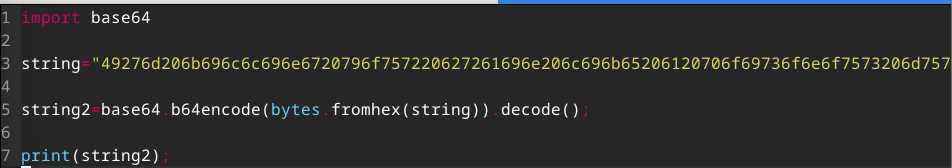
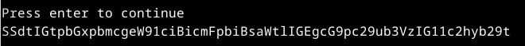
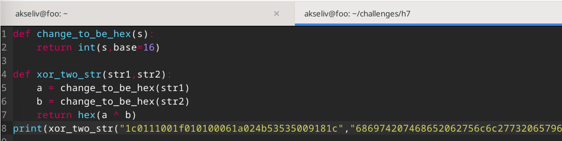
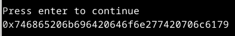

# h7 Uhagre2

## a)

Löysin osoitteesta [https://blog.finxter.com/python-convert-hex-to-base64/](https://blog.finxter.com/python-convert-hex-to-base64/) ohjeet "base64"-kirjaston käyttöön. 
 
Sen avulla hexan kääntäminen base64-formaattiin oli suht yksinkertaista ja selvää.
 
 

 
 

## b)
Löysin osoitteesta [https://stackoverflow.com/questions/36242887/how-to-xor-two-strings-in-python](https://stackoverflow.com/questions/36242887/how-to-xor-two-strings-in-python)
vastaavanlaisen ongelman, johon oli annettu vastaus-ehdotus.
 
 
Koodi näyttää siis tältä:
 

 
Koodissa ensin muunnetaan annetut merkkijonot hex-arvoihinsa, jonka jälkeen
käytetään pythonin "^"-merkkiä palauttamaan parametreiksi annettujen "a"- ja "b"-arvojen yhdistetty XOR-arvo.
 
 
Ja vastaus tältä:
 

